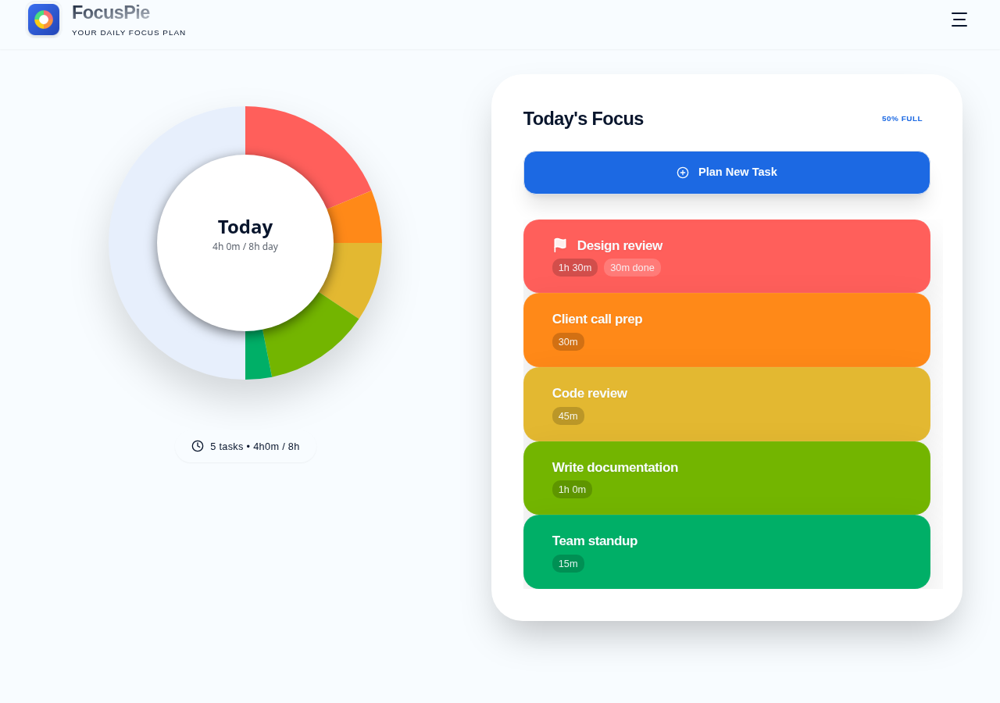
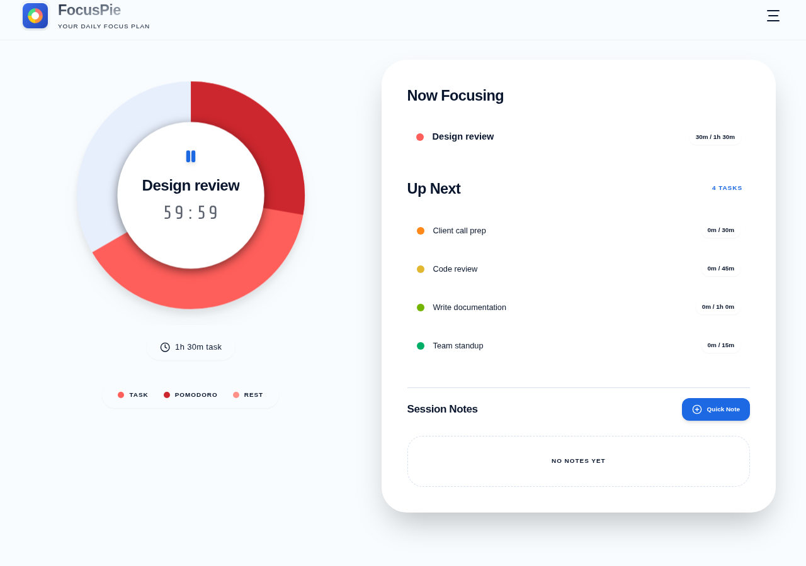

# FocusPie

An ADHD-friendly focus timer: plan your day on an interactive pie chart, then
run Pomodoro sessions against whichever task you select. Built with Next.js
15, React 19, and TypeScript, deployed as a static site with no backend.

**Live demo:** https://matthewpinfield.github.io/pomodoro-timer/




## Features

- 🥧 **Visual day planning** — lay your tasks out on a pie chart against a configurable workday budget
- 🕒 **Pomodoro timer with task-relative progress** — the session ring is scaled against the task's own duration, so a 25-minute pomodoro visibly reads as a small bite of a 2-hour task rather than an arbitrary fraction of the circle
- 🔔 **Sound notifications** — a distinct chime for "pomodoro done, time to rest" vs. "break's over, back to it" (synthesized via the Web Audio API, no audio assets)
- 📋 **Task management** — add, edit, prioritize, and delete tasks; progress is tracked automatically as you work
- 📝 **Session notes** — jot quick notes against the task you're currently focused on
- 🎨 **Dark/light mode**, with a monochrome chart option
- 📱 **Responsive**, tested on real mobile devices

## Getting Started

### Prerequisites

- Node.js 20.x or later
- pnpm

### Installation

1. Clone the repository
```bash
git clone https://github.com/matthewpinfield/pomodoro-timer.git
cd pomodoro-timer
```

2. Install dependencies
```bash
pnpm install
```

3. Run the development server
```bash
pnpm dev
```

4. Open [http://localhost:3000](http://localhost:3000) in your browser

## Usage

1. **Plan your day** — add tasks with a goal duration on the pie chart page; each gets its own colored slice
2. **Start a session** — tap a task to open the timer and begin a pomodoro against it
3. **Stay in flow** — the timer shows both the current pomodoro/break countdown and the task's overall remaining time, with a chime marking each transition
4. **Track progress** — completed time accumulates per task automatically as sessions run

## Tech Stack

- **Framework**: [Next.js 15](https://nextjs.org/) (App Router, static export)
- **UI Library**: [React 19](https://react.dev/)
- **Language**: [TypeScript 5](https://www.typescriptlang.org/)
- **Styling**: [Tailwind CSS 3](https://tailwindcss.com/)
- **Components**: [Radix UI](https://www.radix-ui.com/) primitives
- **Animation**: [Framer Motion](https://www.framer.com/motion/)
- **Forms**: [React Hook Form](https://react-hook-form.com/) with [Zod](https://zod.dev/) validation
- **Dates**: [date-fns](https://date-fns.org/)
- **Theming**: [next-themes](https://github.com/pacocoursey/next-themes)
- **Icons**: [Lucide React](https://lucide.dev/)

No backend — all state (tasks, timer settings, progress) lives in the
browser's `localStorage`. Deploys as a static site via GitHub Actions to
GitHub Pages on every push to `main`.

## Contributing

Contributions are welcome! Please feel free to submit a Pull Request.

## License

This project is licensed under the MIT License - see the [LICENSE](LICENSE) file for details.

## Acknowledgments

- Built with [Next.js](https://nextjs.org/)
- Styled with [Tailwind CSS](https://tailwindcss.com/)
- UI Components from [Radix UI](https://www.radix-ui.com/)
- Icons from [Lucide](https://lucide.dev/)
